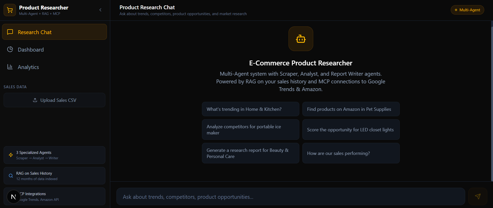
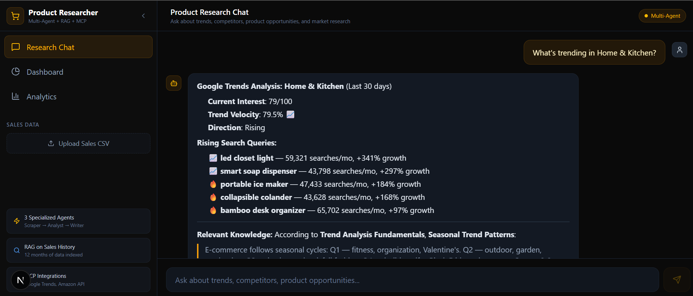

<div align="center">

# 🛒 E-Commerce Product Researcher

### 🤖 Multi-Agent + 📚 RAG + 🔌 MCP

**Automates competitor & trend research for online sellers — Amazon, Shopify & beyond**

[](LICENSE)
[](https://python.org)
[](https://nextjs.org)
[](https://fastapi.tiangolo.com)

</div>

---

## 📸 Screenshots

<div align="center">

### Welcome Screen
*Multi-agent chat interface with suggested research prompts*



<br/><br/>

### Research Chat in Action
*Live Google Trends analysis with rising search queries and RAG-powered insights*



</div>

---

## 📖 Overview

An intelligent product research assistant that combines **three specialized AI agents** (Scraper, Analyst, Report Writer) with **Retrieval-Augmented Generation (RAG)** on historical sales data and **Model Context Protocol (MCP)** connections to Google Trends and Amazon Product APIs.

---

## ✨ Key Features

| Feature | Description |
|---------|-------------|
| 🤖 **Multi-Agent Orchestration** | Scraper Agent → Analyst Agent → Report Writer Agent pipeline |
| 📚 **RAG on Sales History** | Upload your sales CSV and get insights powered by historical data retrieval |
| 🔌 **MCP Integrations** | Google Trends API and Amazon Product Advertising API connections (demo mode) |
| 📊 **7-Dimension Product Scoring** | Trend Velocity, Competition Density, Margin Potential, Shipping Feasibility, Review Sentiment Gap, Seasonality Risk, Ad Creative Potential |
| 🕵️ **Competitor Intelligence** | Automated competitor analysis across Amazon, Shopify, and Walmart |
| 📝 **Client-Ready Reports** | Full research reports with executive summaries and actionable recommendations |
| 💬 **Interactive Chat** | Natural language interface for all research queries |

---

## 🛠️ Agent Tools

| Tool | Agent | Description |
|------|-------|-------------|
| 🔍 `search_trends` | Scraper | Google Trends analysis for any product niche |
| 🛍️ `search_amazon` | Scraper | Amazon product search with BSR, pricing, reviews |
| 🕵️ `analyze_competitors` | Scraper | Multi-platform competitor intelligence |
| 📊 `score_opportunity` | Analyst | 7-dimension product opportunity scoring |
| 📝 `generate_report` | Report Writer | Full research report with recommendations |
| 📈 `get_sales_summary` | Analyst | Historical sales performance analysis |

---

## 🏗️ Tech Stack

### ⚙️ Backend
| Technology | Purpose |
|------------|---------|
| **FastAPI** | Python async API framework |
| **RAG** | TF-IDF cosine similarity retrieval on knowledge base + sales history |
| **Pydantic** | Request/response validation |
| **In-memory stores** | Sales data, research history, chat sessions, analytics |

### 🎨 Frontend
| Technology | Purpose |
|------------|---------|
| **Next.js 16** | React framework with App Router |
| **TypeScript** | Type-safe development |
| **Tailwind CSS 4** | Utility-first styling |
| **Recharts** | Data visualization (bar charts, pie charts) |
| **Lucide React** | Icon library |
| **React Markdown** | Chat message rendering |

---

## 🚀 Quick Start

### 1️⃣ Backend

```bash
cd backend
pip install -r requirements.txt
python main.py
```

> 🌐 The API starts at `http://localhost:8000`. Visit `/docs` for interactive Swagger documentation.

### 2️⃣ Frontend

```bash
cd frontend
npm install
npm run dev
```

> 🌐 The frontend starts at `http://localhost:3000`.

---

## 📡 API Endpoints

| Method | Endpoint | Description |
|--------|----------|-------------|
| `POST` | `/api/v1/chat` | 💬 Chat with the research agent |
| `GET` | `/api/v1/trends/{niche}` | 📈 Get Google Trends data for a niche |
| `GET` | `/api/v1/amazon/{niche}` | 🛍️ Search Amazon products |
| `GET` | `/api/v1/competitors/{product}` | 🕵️ Analyze competitors |
| `GET` | `/api/v1/score/{product}` | 📊 Score a product opportunity |
| `GET` | `/api/v1/report/{niche}` | 📝 Generate full research report |
| `GET` | `/api/v1/sales/summary` | 📈 Get sales performance summary |
| `POST` | `/api/v1/sales/upload` | ⬆️ Upload sales CSV data |
| `GET` | `/api/v1/research/history` | 🗂️ View past research records |
| `GET` | `/api/v1/analytics` | 📊 Agent analytics and metrics |
| `GET` | `/api/v1/health` | 💚 Health check |

---

## 🏛️ Architecture

```
┌─────────────────────────────────────────────────┐
│              🎨 Frontend (Next.js)               │
│  ┌──────────┐ ┌───────────┐ ┌─────────────────┐ │
│  │ 💬 Chat  │ │ 📊 Dash   │ │ 📈 Analytics   │ │
│  └────┬─────┘ └─────┬─────┘ └───────┬─────────┘ │
└───────┼─────────────┼───────────────┼────────────┘
        │             │               │
        ▼             ▼               ▼
┌─────────────────────────────────────────────────┐
│              ⚙️ Backend (FastAPI)                │
│                                                   │
│  ┌─────────────────────────────────────────────┐ │
│  │        🤖 Agent Orchestrator                 │ │
│  │  ┌─────────┐ ┌─────────┐ ┌───────────────┐ │ │
│  │  │ Scraper │→│ Analyst │→│ Report Writer │ │ │
│  │  └─────────┘ └─────────┘ └───────────────┘ │ │
│  └─────────────────────────────────────────────┘ │
│                                                   │
│  ┌──────────────┐  ┌────────────────────────┐    │
│  │ 📚 RAG Engine│  │ 🔌 MCP Connections     │    │
│  │  - Knowledge │  │  - Google Trends API   │    │
│  │  - Sales CSV │  │  - Amazon Product API  │    │
│  │  - Research  │  │  - Web Scraping        │    │
│  └──────────────┘  └────────────────────────┘    │
└──────────────────────────────────────────────────┘
```

---

## 📊 Product Scoring Model

Products are scored on **7 dimensions** (0–100 each):

| Dimension | Weight | Description |
|-----------|--------|-------------|
| 📈 Trend Velocity | 20% | Google Trends slope + social mentions |
| 🏟️ Competition Density | 18% | Seller count + review moat (inverted) |
| 💰 Margin Potential | 20% | (Price − landed cost − ad cost) / price |
| 🚚 Shipping Feasibility | 12% | US warehouse availability + speed |
| ⭐ Review Sentiment Gap | 10% | Competitor negative reviews = opportunity |
| 🌦️ Seasonality Risk | 10% | Demand consistency (inverted) |
| 🎨 Ad Creative Potential | 10% | Visual appeal + demo-ability |

> 🏆 **Composite Score** = Weighted average. Products scoring **>75** are strong candidates.

---

## 🔐 Environment Variables

### Backend (`backend/.env`)
```env
PORT=8000
OPENAI_API_KEY=sk-...          # Optional — for production LLM
GOOGLE_TRENDS_API_KEY=...      # Optional — for live trends
AMAZON_PA_API_KEY=...          # Optional — for live Amazon data
```

### Frontend (`frontend/.env`)
```env
NEXT_PUBLIC_API_URL=http://localhost:8000
```

---

## 📄 License

MIT License — see [LICENSE](LICENSE) for details.

---

<div align="center">

**Built with ❤️ for e-commerce sellers and product researchers**

</div>
